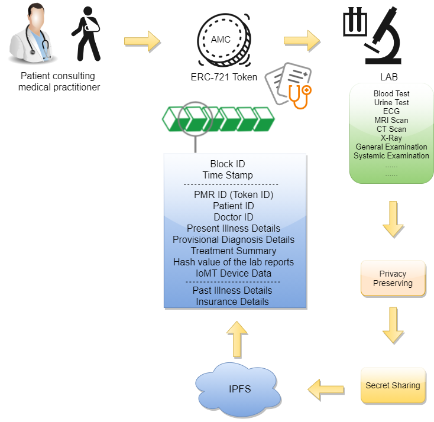

# Medical Record Management based on Distributed Ledger and Storage 
      
   

## Abstract 
Blockchain Technology has seen adoption to infinite domains, health care sector is one of the major domains where there are a greater opportunity and advantage to leverage the benefits of distributed ledgers in storing and securing patient medical records. The Government of India (GoI) is also very keen on digitization in addition to their wider adoption of blockchain technology to serve the citizens by ensuring their privacy and security of personally sensitive information. In this paper, we propose a framework for the secure management of patient medical records (PMR) based on the Ethereum blockchain. The PMR is tokenized using the ERC-721 standard which is a Non-Fungible Token (NFT) that can be uniquely mapped to the individual patient. To ensure a higher level of security and non-redundancy, the medical records are stored and maintained in distributed storage like InterPlanetary File System (IPFS); to ensure privacy, the patient's sensitive information is anonymized through a privacy-preserving scheme. To provide complete control of the medical record to individual patients, we have employed a secret sharing scheme with essential share that is owned by the patient. The proposed framework aims to provide correctness and consistency in managing the PMR over its life cycle.

## Proposed Architecture 

## Usecases 
  - <b>Hospital and Doctor Registration</b>
  
  

  
  

  
  - <b>Patient Registration</b>
  
  

  
  

  
  - <b>Patient Consulting Doctor</b>
  
  

  
  

  
  - <b>Lab Diagnostics</b>
  
  

  
  

## Demo
[Click here](https://amrita-tifac-cyber-blockchain.github.io/Medical-Record-Management-based-on-Distributed-Ledger-and-Storage/UI/index.html) to access the webpage.

## Acknowledgement
We would like to acknowldge the support provided by **TIFAC-CORE in Cyber Security**, Amrita School of Engineering, Amrita Vishwa Vidyapeetham, Coimbatore, India in carrying out this work as part of "**18CY712 - Blockchain Technology**" Course. 

## References
 - Ramaguru R, Minu M. Blockchain Terminologies. NamChain Open Initiative Research Lab (2021). https://github.com/NamChain-Open-Initiative-Research-Lab/Blockchain-Terminologies

 - Samal D., Arul R. (2020) A Novel Privacy Preservation Scheme for Internet of Things Using Blockchain Strategy. In: Bindhu V., Chen J., Tavares J. (eds) International Conference on Communication, Computing and Electronics Systems. Lecture Notes in Electrical Engineering, vol 637. Springer, Singapore. https://doi.org/10.1007/978-981-15-2612-1_66

 - Kripa M., Nidhin Mahesh A., Ramaguru R., Amritha P.P. (2021) Blockchain Framework for Social Media DRM Based on Secret Sharing. In: Senjyu T., Mahalle P.N., Perumal T., Joshi A. (eds) Information and Communication Technology for Intelligent Systems. ICTIS 2020. Smart Innovation, Systems and Technologies, vol 195. Springer, Singapore. https://doi.org/10.1007/978-981-15-7078-0_43

 - A. Azaria, A. Ekblaw, T. Vieira and A. Lippman, "MedRec: Using Blockchain for Medical Data Access and Permission Management," 2016 2nd International Conference on Open and Big Data (OBD), Vienna, 2016, pp. 25-30, doi: 10.1109/OBD.2016.11.

 - Alex Roehrs, Cristiano André da Costa, Rodrigo da Rosa Righi,OmniPHR: A distributed architecture model to integrate personal health records,Journal of Biomedical Informatics,Volume 71,2017,Pages 70-81,ISSN 1532-0464, https://doi.org/10.1016/j.jbi.2017.05.012.

 - Gaby G. Dagher, Jordan Mohler, Matea Milojkovic, Praneeth Babu Marella, Ancile: Privacy-preserving framework for access control and interoperability of electronic health records using blockchain technology,Sustainable Cities and Society, Volume 39,2018,Pages 283-297,ISSN 2210-6707, https://doi.org/10.1016/j.scs.2018.02.014.

 - J. Huang, Y. W. Qi, M. R. Asghar, A. Meads and Y. Tu, "MedBloc: A Blockchain-Based Secure EHR System for Sharing and Accessing Medical Data," 2019 18th IEEE International Conference On Trust, Security And Privacy In Computing And Communications/13th IEEE International Conference On Big Data Science And Engineering (TrustCom/BigDataSE), Rotorua, New Zealand, 2019, pp. 594-601, doi: 10.1109/TrustCom/BigDataSE.2019.00085.

 - E. Daraghmi, Y. Daraghmi and S. Yuan, "MedChain: A Design of Blockchain-Based System for Medical Records Access and Permissions Management," in IEEE Access, vol. 7, pp. 164595-164613, 2019, doi: 10.1109/ACCESS.2019.2952942.

 - M. M. Madine et al., "Blockchain for Giving Patients Control Over Their Medical Records," in IEEE Access, vol. 8, pp. 193102-193115, 2020, doi: 10.1109/ACCESS.2020.3032553.

## Publication
Anjum S., Ramaguru R., Sethumadhavan M. (2021) Medical Records Management Using Distributed Ledger and Storage. In: Singh M., Tyagi V., Gupta P.K., Flusser J., Ören T., Sonawane V.R. (eds) Advances in Computing and Data Sciences. ICACDS 2021. Communications in Computer and Information Science, vol 1441. Springer, Cham. https://doi.org/10.1007/978-3-030-88244-0_6

