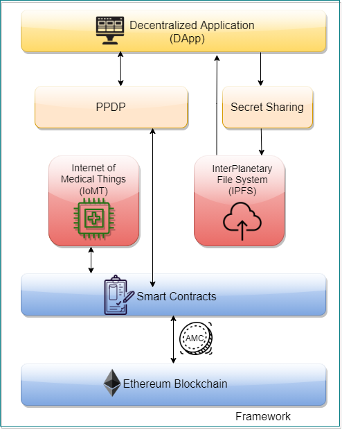
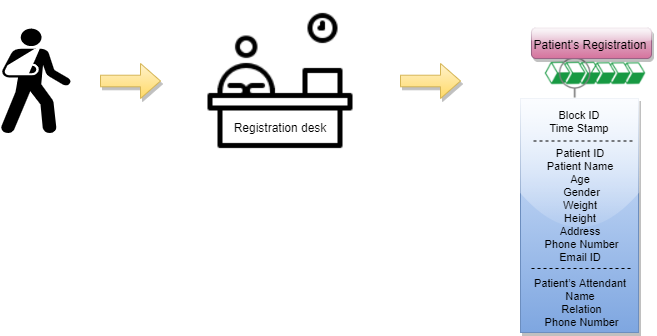
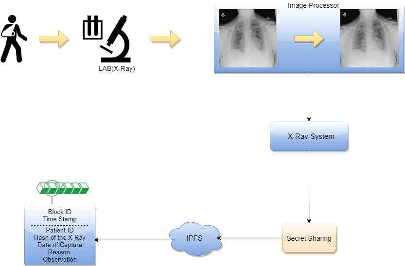

# Medical Record Management based on Distributed Ledger and Storage

## Abstract 

## Proposed Architecture 

## Usecases 
  - Hospital and Doctor Registration
  
  
  - Patient Registration
  
  
  - Patient Consulting Doctor
  
  - Lab Diagnostics
  

## Demo
[Click here](https://amrita-tifac-cyber-blockchain.github.io/Patient-Medical-Records/) to access the webpage.

## Acknowledgement
We would like to acknowldge the support provided by TIFAC-CORE in Cyber Security, Amrita School of Engineering, Amrita Vishwa Vidyapeetham, Coimbatore in carrying out this work as part of "Blockchain Technology" Course. 

## References
Ramaguru R, Minu M. Blockchain Terminologies. NamChain Open Initiative Research Lab (2021). \url{https://github.com/NamChain-Open-Initiative-Research-Lab/Blockchain-Terminologies}

Samal D., Arul R. (2020) A Novel Privacy Preservation Scheme for Internet of Things Using Blockchain Strategy. In: Bindhu V., Chen J., Tavares J. (eds) International Conference on Communication, Computing and Electronics Systems. Lecture Notes in Electrical Engineering, vol 637. Springer, Singapore. https://doi.org/10.1007/978-981-15-2612-1\_66

Kripa M., Nidhin Mahesh A., Ramaguru R., Amritha P.P. (2021) Blockchain Framework for Social Media DRM Based on Secret Sharing. In: Senjyu T., Mahalle P.N., Perumal T., Joshi A. (eds) Information and Communication Technology for Intelligent Systems. ICTIS 2020. Smart Innovation, Systems and Technologies, vol 195. Springer, Singapore. https://doi.org/10.1007/978-981-15-7078-0\_43

A. Azaria, A. Ekblaw, T. Vieira and A. Lippman, "MedRec: Using Blockchain for Medical Data Access and Permission Management," 2016 2nd International Conference on Open and Big Data (OBD), Vienna, 2016, pp. 25-30, doi: 10.1109/OBD.2016.11.

Alex Roehrs, Cristiano André da Costa, Rodrigo da Rosa Righi,OmniPHR: A distributed architecture model to integrate personal health records,Journal of Biomedical Informatics,Volume 71,2017,Pages 70-81,ISSN 1532-0464,https://doi.org/10.1016/j.jbi.2017.05.012..

Gaby G. Dagher, Jordan Mohler, Matea Milojkovic, Praneeth Babu Marella, Ancile: Privacy-preserving framework for access control and interoperability of electronic health records using blockchain technology,Sustainable Cities and Society, Volume 39,2018,Pages 283-297,ISSN 2210-6707, https://doi.org/10.1016/j.scs.2018.02.014.

J. Huang, Y. W. Qi, M. R. Asghar, A. Meads and Y. Tu, "MedBloc: A Blockchain-Based Secure EHR System for Sharing and Accessing Medical Data," 2019 18th IEEE International Conference On Trust, Security And Privacy In Computing And Communications/13th IEEE International Conference On Big Data Science And Engineering (TrustCom/BigDataSE), Rotorua, New Zealand, 2019, pp. 594-601, doi: 10.1109/TrustCom/BigDataSE.2019.00085.

E. Daraghmi, Y. Daraghmi and S. Yuan, "MedChain: A Design of Blockchain-Based System for Medical Records Access and Permissions Management," in IEEE Access, vol. 7, pp. 164595-164613, 2019, doi: 10.1109/ACCESS.2019.2952942.

M. M. Madine et al., "Blockchain for Giving Patients Control Over Their Medical Records," in IEEE Access, vol. 8, pp. 193102-193115, 2020, doi: 10.1109/ACCESS.2020.3032553.

